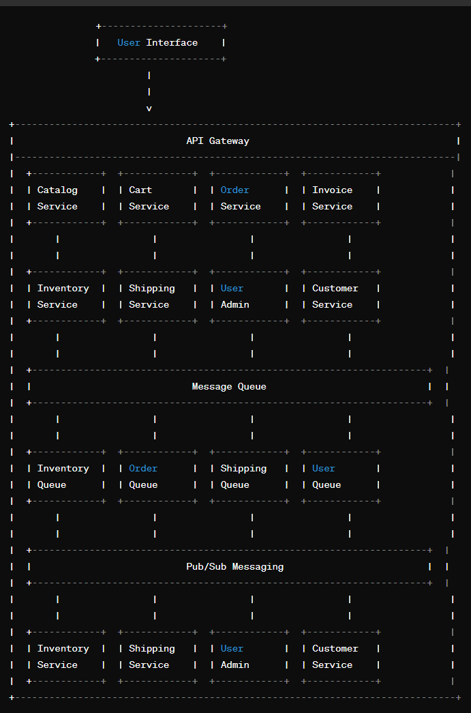

# Microservices with Event-Driven Architecture

Building an e-commerce application with microservices architecture is a great approach for scalability, flexibility, and maintainability. Below is a list of microservices that you can consider for your e-commerce application:

Incorporating event-driven architecture with message queue microservices can further enhance the scalability and responsiveness of your e-commerce application. Here's how you can integrate these concepts into the microservices mentioned earlier:

## Microservices

### Catalog Service

- Subscribes to events related to product updates or inventory changes.
- Upon receiving such events, updates its local cache of product data to ensure it's up-to-date.

### Cart Service

- Utilizes message queues to asynchronously process cart-related events such as adding/removing items.
- Publishes events when the cart is updated, allowing other services to react accordingly.

### Order Service

- Listens to events indicating that an order needs to be created.
- Subscribes to events from the Cart Service to retrieve the latest cart contents.
- Upon order creation, publishes events to notify other services such as the Inventory Service and the Shipping Service.

### Invoice Service

- Subscribes to events indicating that an order has been placed.
- Generates invoices based on the order information and publishes events related to invoice generation.

### Inventory Service

- Listens to events indicating changes in inventory levels (e.g., due to new orders).
- Updates its inventory database accordingly.
- Publishes events when inventory levels are updated to notify other services.

### Shipping Service

- Listens to events indicating that orders need to be shipped.
- Integrates with shipping carriers to fulfill orders.
- Publishes events when shipments are dispatched or delivered.

### User-Administration Service

- Utilizes message queues for handling user-related events such as profile updates or address changes.
- Publishes events to notify other services of changes in user data.

### Customer Service

- Subscribes to events related to order completion and updates customer profiles and order history accordingly.
- Utilizes pub/sub messaging for notifying customers about order updates and shipping details.

Each of these microservices should be designed to be independently deployable and scalable. They should communicate with each other via APIs, and you may want to consider implementing authentication and authorization mechanisms to secure the communication between services.

In this architecture, services communicate asynchronously through message queues, which decouples them and allows for better scalability and fault tolerance. Pub/sub messaging enables real-time updates and notifications to relevant services and users.

### In addition to these core microservices, you may also need supporting services such as:

- Payment Service: Integrates with payment gateways to handle payment processing.
- Notification Service: Sends notifications to users (e.g., order confirmation, shipment updates).
- Analytics Service: Collects and analyzes data related to user behavior, sales, etc., to provide insights for business decisions.

Remember to design your microservices with a focus on loose coupling and high cohesion to achieve the benefits of microservices architecture effectively. Additionally, consider using technologies and frameworks that support .NET 6, such as ASP.NET Core, Entity Framework Core, and gRPC for inter-service communication.

You can implement message queues using technologies like RabbitMQ, Kafka, or Azure Service Bus, and for pub/sub messaging, you can use frameworks like SignalR or PubNub.

By incorporating event-driven architecture with message queues and pub/sub messaging, your e-commerce application becomes more responsive, scalable, and resilient to failures.

## Articles

[Empowering Event-Driven Architectures in .NET Core](https://medium.com/@swanasimran/cap-empowering-event-driven-architectures-in-net-core-e26b688d4aa8)

[Refactoring with Event-Driven Architecture on AWS](https://www.freecodecamp.org/news/deep-dive-into-event-driven-architecture-on-aws/)

[How to Choose a Message Queue? Kafka vs. RabbitMQ](https://blog.bytebytego.com/p/how-to-choose-a-message-queue-kafka)

[Choosing Between Message Queues and Event Streams](https://thenewstack.io/choosing-between-message-queues-and-event-streams/)

## Diagram

