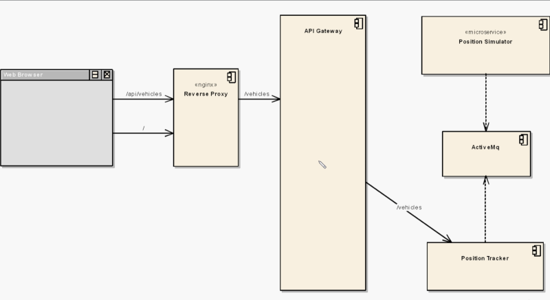

# Kubernetes Hands-On - Deploy Microservices to the AWS Cloud

## Overview

[Udemy Course](https://www.udemy.com/course/kubernetes-microservices/?couponCode=KEEPLEARNING)

[Course Docker Images](https://hub.docker.com/u/richardchesterwood)

[Course Github Repo for the Docker Images](https://github.com/DickChesterwood/k8s-fleetman)



## Kubernetes Configuration File

The Kubernetes configuration file, typically located at `~/.kube/config`, determines which Kubernetes cluster `kubectl` commands interact with.

To confirm that `kubectl` is set up to interact with your local Kubernetes cluster, you can use the following command:

```powershell
kubectl config current-context
```

This command displays the current context, which includes the cluster, user, and namespace that `kubectl` commands interact with.

If you're using Docker Desktop for Windows with Kubernetes, the current context should be `docker-desktop`.

### List All Contexts

The `kubectl` command to list all contexts available is:

```powershell
kubectl config get-contexts
```

This command will display a table that includes the name, cluster, authentication info, and namespace for each context. The current context is marked with a \* in the `CURRENT` column.

### Switch Context

If the current context is not your local Kubernetes cluster, you can use the following command to set it:

```powershell
kubectl config use-context docker-desktop
```

After running this command, `kubectl` commands should interact with your local Kubernetes cluster.

### Create AWS EKS Cluster and Add Kubernetes Context to Kubernetes Configuration File

```powershell
# run the following command to create an AWS EKS cluster:
eksctl create cluster --name fleetman --nodes-min=3
```

When you create an EKS cluster using `eksctl`, it automatically updates your Kubernetes configuration file (`~/.kube/config`) to include a context for the new cluster. The context is named after the EKS cluster, so in your case, the context will be named `fleetman`.

You can switch to this context using the `kubectl config use-context` command:

```powershell
kubectl config use-context fleetman
```

This command sets the current context to `fleetman`, so `kubectl` commands will interact with the `fleetman` EKS cluster.

You can confirm that the context has been set correctly by running:

```powershell
kubectl config current-context
```

This command should output `fleetman` if the context has been set correctly.

### Delete AWS EKS Cluster and Remove Kubernetes Context from Kubernetes Configuration file

The command to delete an EKS cluster using `eksctl` is:

```powershell
eksctl delete cluster --name=fleetman
```

After deleting the EKS cluster, you can remove the corresponding context from your Kubernetes configuration file using the `kubectl config delete-context` command:

```powershell
kubectl config delete-context fleetman
```

This command removes the `fleetman` context from your Kubernetes configuration file. After running this command, `kubectl` commands will no longer be able to interact with the `fleetman` EKS cluster, because it no longer exists.

## AWS

### Add Tag Name to all AWS Resources for tracking purposes

Tag Name: Project
Tag Value: k8s-demo-tracking

### EKS

[Download AWS CLI](https://docs.aws.amazon.com/cli/latest/userguide/getting-started-install.html)

[Configure AWS CLI](https://docs.aws.amazon.com/cli/latest/userguide/cli-chap-configure.html)

[eksctl - Official CLI for AWS EKS](https://eksctl.io/)

```powershell
# Check AWS CLI
aws --version

# Check ekscli
eksctl version

aws eks list-clusters

```

## Dockerhub images

Intel/AMD user will be using an image from Dockerhub like this:

image: richardchesterwood/k8s-fleetman-webapp-angular:release1

```powershell
docker container run -d -e "SPRING_PROFILES_ACTIVE=local-microservice" --name fleetman-webapp --network fleetman -p 8080:80 richardchesterwood/k8s-fleetman-webapp-angular:release1
```

## Kubernetes Documentation

[Docs Reference](https://kubernetes.io/docs/reference/)

[Kubernetes API](https://kubernetes.io/docs/reference/kubernetes-api/)

[API Reference](https://kubernetes.io/docs/reference/generated/kubernetes-api/v1.29/)

```powershell
kubectl version

kubectl get all

kubectl cluster-info

kubectl get services
NAME            TYPE        CLUSTER-IP   EXTERNAL-IP   PORT(S)   AGE
kubernetes      ClusterIP   10.96.0.1    <none>        443/TCP   7h8m
[ServiceName]   [NodePort]  ???          ???           ???       ???
kubectl get service [ServiceName]

```

## Chapters

### 5 Pod

```powershell
# create pod
cd '.\course-resources\Chapter 5 Pods'
kubectl apply -f first-pod.yaml
pod/webapp created
# delete pod
kubectl delete -f first-pod.yaml

kubectl get pods

kubectl describe pod webapp

kubectl exec webapp ls

# connect to pod
kubectl -it exec webapp sh
# list folders
ls
# download index.html
wget http://localhost
Connecting to localhost (127.0.0.1:80)
index.html           100%
# read index.html
cat index.html

# If you are using the Kubernetes that ships with Docker Desktop,
# then you just use "localhost" or "127.0.0.1" as the address.
# Don't forget the port number of your NodePort. so "127.0.0.1:30080" should work for the webapp.
# Sometimes with docker desktop , localhost doesn't work and you will need the following command:
kubectl port-forward svc/fleetman-webapp 30080:80

```

### 6 Service

```powershell
# create pod
cd '.\course-resources\Chapter 6 Services'
kubectl apply -f first-pod.yaml
pod/webapp created
# delete pod
kubectl delete -f first-pod.yaml

# create service
kubectl apply -f webapp-service.yaml
service/fleetman-webapp created
# delete service
kubectl delete -f webapp-service.yaml

# describe service
kubectl describe svc fleetman-webapp

# show pod labels
kubectl get pods --show-labels

# show pods filtered by label
kubectl get pods --show-labels -l release=0
```

Kubernetes embedded within Docker Desktop
Open browser: http://localhost:30080/

### 7 ActiveMQ

Kubernetes embedded within Docker Desktop, uses localhost:30080 to access Service for Frontend Pod.

For the ActiveMq queue, we will need to access it on localhost:30010.

If it is not accessible, run the following port-forward command:

```powershell
kubectl port-forward svc/fleetman-queue 30010:8161
```

```powershell
cd '.\course-resources\Chapter 7 Exercise'
# Create
kubectl apply -f .

kubectl get all

Kubernetes embedded within Docker Desktop
WebApp: http://localhost:30080/
Queue: http://localhost:30010/
# username: admin
# password: admin

# Delete
kubectl delete -f .
```

### 8 ReplicaSets

```powershell
cd '.\course-resources\Chapter 8 ReplicaSets'
# Create
kubectl apply -f .

kubectl get all

Kubernetes embedded within Docker Desktop
WebApp: http://localhost:30080/
Queue: http://localhost:30010/
# username: admin
# password: admin

# Delete
kubectl delete -f .
```

### 9 Deployments

```powershell
cd '.\course-resources\Chapter 9 Deployments'
# Create
kubectl apply -f .

kubectl get all

# Modify and redeploy Deployment
kubectl apply -f .
# Check Deployment Rollout Status
kubectl rollout status deployment webapp
# Check Deployment Rollout History
kubectl rollout history deployment webapp

Kubernetes embedded within Docker Desktop
WebApp: http://localhost:30080/
Queue: http://localhost:30010/
# username: admin
# password: admin

# Delete
kubectl delete -f .
```

## 10 Networking and Service Discovery

```powershell
# Namespaces
kubectl get all # default namespace

kubectl get namespaces
NAME              STATUS   AGE
default           Active   164m
kube-node-lease   Active   164m
kube-public       Active   164m
kube-system       Active   164m

kubectl get all -n kube-system


cd '.\course-resources\Chapter 10 Networking'
# Create
kubectl apply -f pods.yaml
kubectl apply -f services.yaml
kubectl apply -f networking-tests.yaml


# Kubernetes embedded within Docker Desktop
# WebApp: http://localhost:30080/
# Queue: http://localhost:30010/
# username: admin
# password: admin

# Delete
kubectl delete -f networking-tests.yaml
kubectl delete -f services.yaml
kubectl delete -f pods.yaml
```

## 11 Microservices

```powershell
kubectl get all

cd '.\course-resources\Chapter 11 Microservices'
# Create
kubectl apply -f .

kubectl describe pod position-tracker-5bdbd5c58-4nkr6
kubectl describe pod api-gateway-77bf7dcbc-kl6xh
kubectl logs -f api-gateway-77bf7dcbc-kl6xh

# Kubernetes embedded within Docker Desktop
# WebApp: http://localhost:30080/
# Queue: http://localhost:30010/
# Tracker on NodePort: http://localhost:30020/vehicles/City Truck
# api-gateway on NodePort: http://localhost:30020
# username: admin
# password: admin

# Delete
kubectl delete -f .
```

## 12 Persistence

```powershell
kubectl get all

cd '.\course-resources\Chapter 12 Persistence'
# Create
kubectl apply -f .

# Kubernetes embedded within Docker Desktop
# WebApp: http://localhost:30080/
# Queue: http://localhost:30010/
# Tracker on NodePort: http://localhost:30020/vehicles/City Truck
# api-gateway on NodePort: http://localhost:30020
# username: admin
# password: admin

# Delete
kubectl delete -f .
```

## 13 AWS - Videos 13, 15, 16

### Videos 13, 15, 16

Setup Kubernetes Nodes for resources:

- API Gateway
- Position Tracker
- Mongo Db
- Position Simulator
- Active Mq

Mongo Db requires EBS resource.

```powershell
kubectl get all

cd '.\course-resources\Chapter 13 AWS'
# Create eks cluster -- SEE install-eks.txt
eksctl create cluster --name fleetman --nodes-min=3 --dry-run
# List Clusters
aws eks list-clusters
# Describe Cluster - The status will be one of CREATING, ACTIVE, DELETING, FAILED, or UPDATING.
aws eks describe-cluster --name fleetman --query "cluster.status" --region [your-region]

# Create EBS storage
## NOTE: you need to
kubectl apply -f storage-aws.yaml

storageclass.storage.k8s.io/cloud-ssd created
persistentvolumeclaim/mongo-pvc created

# List PersistentVolumeClaim
kubectl get pvc mongo-pvc
NAME        STATUS    VOLUME   CAPACITY   ACCESS MODES   STORAGECLASS   AGE
mongo-pvc   Pending                                      cloud-ssd      6m24s
# List EBS StorageClass
kubectl get sc cloud-ssd
NAME        PROVISIONER             RECLAIMPOLICY   VOLUMEBINDINGMODE   ALLOWVOLUMEEXPANSION   AGE
cloud-ssd   kubernetes.io/aws-ebs   Delete          Immediate           false                  6m34s
# more detailed information, you can use the kubectl describe command instead of kubectl get
kubectl describe pvc mongo-pvc
kubectl describe sc cloud-ssd
# Create Mondgo DB POD/Service
kubectl apply -f mongo-stack.yaml
# List Mongo Pod
kubectl get all
kubect describe [POD_NAME]

# Create Workload PODS
kubectl apply -f workloads.yaml

deployment.apps/queue created
deployment.apps/position-simulator created
deployment.apps/position-tracker created
deployment.apps/api-gateway created
deployment.apps/webapp created

# List Workload PODS
kubectl get all

# Create Services
kubectl apply -f services.yaml

service/fleetman-webapp created
service/fleetman-queue created
service/fleetman-position-tracker created
service/fleetman-api-gateway created

# List Services
kubectl get all

# Check Logs on Postion Tracker POD
kubectl logs -f [POD_NAME]

kubectl get svc
kubectl get pods -o wide # list node each pod is running on

# Kubernetes embedded within Docker Desktop
# WebApp: http://localhost:30080/
# Queue: http://localhost:30010/
# Tracker on NodePort: http://localhost:30020/vehicles/City Truck
# api-gateway on NodePort: http://localhost:30020
# username: admin
# password: admin

# Delete Deployments
kubectl delete -f .

# Delete Cluster
eksctl delete cluster --name=fleetman
```

### Creating Cluster

```powershell
eksctl create cluster --name fleetman --nodes-min=3
2024-04-16 15:21:41 [ℹ]  eksctl version 0.167.0
2024-04-16 15:21:41 [ℹ]  using region us-east-1
2024-04-16 15:21:41 [ℹ]  setting availability zones to [us-east-1a us-east-1c]
2024-04-16 15:21:41 [ℹ]  subnets for us-east-1a - public:192.168.0.0/19 private:192.168.64.0/19
2024-04-16 15:21:41 [ℹ]  subnets for us-east-1c - public:192.168.32.0/19 private:192.168.96.0/19
2024-04-16 15:21:41 [ℹ]  nodegroup "ng-2e03dcb7" will use "" [AmazonLinux2/1.27]
2024-04-16 15:21:41 [ℹ]  using Kubernetes version 1.27
2024-04-16 15:21:41 [ℹ]  creating EKS cluster "fleetman" in "us-east-1" region with managed nodes
2024-04-16 15:21:41 [ℹ]  will create 2 separate CloudFormation stacks for cluster itself and the initial managed nodegroup
2024-04-16 15:21:41 [ℹ]  if you encounter any issues, check CloudFormation console or try 'eksctl utils describe-stacks --region=us-east-1 --cluster=fleetman'
2024-04-16 15:21:41 [ℹ]  Kubernetes API endpoint access will use default of {publicAccess=true, privateAccess=false} for cluster "fleetman" in "us-east-1"
2024-04-16 15:21:41 [ℹ]  CloudWatch logging will not be enabled for cluster "fleetman" in "us-east-1"
2024-04-16 15:21:41 [ℹ]  you can enable it with 'eksctl utils update-cluster-logging --enable-types={SPECIFY-YOUR-LOG-TYPES-HERE (e.g. all)} --region=us-east-1 --cluster=fleetman'
2024-04-16 15:21:41 [ℹ]
2 sequential tasks: { create cluster control plane "fleetman",
    2 sequential sub-tasks: {
        wait for control plane to become ready,
        create managed nodegroup "ng-2e03dcb7",
    }
}
2024-04-16 15:21:41 [ℹ]  building cluster stack "eksctl-fleetman-cluster"
2024-04-16 15:21:41 [ℹ]  deploying stack "eksctl-fleetman-cluster"
2024-04-16 15:22:11 [ℹ]  waiting for CloudFormation stack "eksctl-fleetman-cluster"
2024-04-16 15:33:45 [ℹ]  building managed nodegroup stack "eksctl-fleetman-nodegroup-ng-2e03dcb7"
2024-04-16 15:33:45 [ℹ]  deploying stack "eksctl-fleetman-nodegroup-ng-2e03dcb7"
2024-04-16 15:33:45 [ℹ]  waiting for CloudFormation stack "eksctl-fleetman-nodegroup-ng-2e03dcb7"
2024-04-16 15:37:00 [ℹ]  waiting for the control plane to become ready
2024-04-16 15:37:01 [✔]  saved kubeconfig as "C:\\Users\\jpcas\\.kube\\config"
2024-04-16 15:37:01 [ℹ]  no tasks
2024-04-16 15:37:01 [✔]  all EKS cluster resources for "fleetman" have been created
2024-04-16 15:37:01 [ℹ]  nodegroup "ng-2e03dcb7" has 3 node(s)
2024-04-16 15:37:01 [ℹ]  node "ip-192-168-19-173.ec2.internal" is ready
2024-04-16 15:37:01 [ℹ]  node "ip-192-168-31-199.ec2.internal" is ready
2024-04-16 15:37:01 [ℹ]  node "ip-192-168-50-144.ec2.internal" is ready
2024-04-16 15:37:01 [ℹ]  waiting for at least 3 node(s) to become ready in "ng-2e03dcb7"
2024-04-16 15:37:01 [ℹ]  nodegroup "ng-2e03dcb7" has 3 node(s)
2024-04-16 15:37:01 [ℹ]  node "ip-192-168-19-173.ec2.internal" is ready
2024-04-16 15:37:01 [ℹ]  node "ip-192-168-31-199.ec2.internal" is ready
2024-04-16 15:37:01 [ℹ]  node "ip-192-168-50-144.ec2.internal" is ready
2024-04-16 15:37:02 [ℹ]  kubectl command should work with "C:\\Users\\jpcas\\.kube\\config", try 'kubectl get nodes'
2024-04-16 15:37:02 [✔]  EKS cluster "fleetman" in "us-east-1" region is ready
```

### Deleting Cluster

```powershell
# Delete Cluster
eksctl delete cluster --name=fleetman
```

Confirm resources are deleted on AWS:

- LoadBalancer:
  > EC2 > LoadBalancer
- EC2 Instances
  > EC2 > Instances
- EKS
  > EKS > Clusters
- EBS Volume
  > EC2 > Elastic Block Store > Volumes
- CloudFormation Stack
  > CloudFormation > Stacks
- IAM Roles

### Install AWS EBS CSI driver

[AWS EBS CSI Driver](https://docs.aws.amazon.com/eks/latest/userguide/ebs-csi.html)

Before you can create the StorageClass and PersistentVolumeClaim (PVC) and use them in your MongoDB deployment, you need to ensure that the AWS EBS CSI driver is installed in your EKS cluster. The AWS EBS CSI driver enables EKS to use AWS EBS volumes for persistent storage.

Here are the steps:

1. Update the IAM policy for your worker nodes

Your worker nodes need permissions to access EBS. You can add these permissions by attaching the `AmazonEBSCSIDriverPolicy` policy to the IAM role that's associated with your worker nodes.

You can do this in the AWS Management Console:

Go to the IAM service.
Find the `IAM role` that's associated with your worker nodes. This is usually named something like `eksctl-[cluster-name]-NodeInstanceRole-[random-string]`.
Click on the role to view its details.
Click on `"Attach policies"`.
In the search box, type `AmazonEBSCSIDriverPolicy` and select the policy from the list.
Click on `"Attach policy"`.

2. Install the AWS EBS CSI driver

You can install the AWS EBS CSI driver using Helm or kubectl. Here's how to do it with kubectl:

```powershell
kubectl apply -k "github.com/kubernetes-sigs/aws-ebs-csi-driver/deploy/kubernetes/overlays/stable/ecr/?ref=master"

serviceaccount/ebs-csi-controller-sa created
serviceaccount/ebs-csi-node-sa created
role.rbac.authorization.k8s.io/ebs-csi-leases-role created
clusterrole.rbac.authorization.k8s.io/ebs-csi-node-role created
clusterrole.rbac.authorization.k8s.io/ebs-external-attacher-role created
clusterrole.rbac.authorization.k8s.io/ebs-external-provisioner-role created
clusterrole.rbac.authorization.k8s.io/ebs-external-resizer-role created
clusterrole.rbac.authorization.k8s.io/ebs-external-snapshotter-role created
rolebinding.rbac.authorization.k8s.io/ebs-csi-leases-rolebinding created
clusterrolebinding.rbac.authorization.k8s.io/ebs-csi-attacher-binding created
clusterrolebinding.rbac.authorization.k8s.io/ebs-csi-node-getter-binding created
clusterrolebinding.rbac.authorization.k8s.io/ebs-csi-provisioner-binding created
clusterrolebinding.rbac.authorization.k8s.io/ebs-csi-resizer-binding created
clusterrolebinding.rbac.authorization.k8s.io/ebs-csi-snapshotter-binding created
deployment.apps/ebs-csi-controller created
poddisruptionbudget.policy/ebs-csi-controller created
daemonset.apps/ebs-csi-node created
csidriver.storage.k8s.io/ebs.csi.aws.com created
```

3. Verify the installation

You can verify that the EBS CSI driver is running by checking the pods in the kube-system namespace:

```powershell
kubectl get pods -n kube-system | Select-String "ebs-csi"

ebs-csi-controller-8f9984564-2z98p   6/6     Running   0          54s
ebs-csi-controller-8f9984564-bxxqr   6/6     Running   0          54s
ebs-csi-node-5zs8s                   3/3     Running   0          54s
ebs-csi-node-b9w84                   3/3     Running   0          54s
ebs-csi-node-ncm96                   3/3     Running   0          54s
```

You should see several pods with names that start with `ebs-csi`.

After these steps, your EKS cluster should be able to use EBS volumes. You can create a PersistentVolume that uses the ebs.csi.aws.com storage class, and then create a PersistentVolumeClaim to use this volume in your pods.

### Create the StorageClass and PersistentVolumeClaim

Apply the storage-aws.yaml file to create the StorageClass and PersistentVolumeClaim:

```powershell
kubectl apply -f storage-aws.yaml
```

### Create the MongoDB deployment and service

Apply the mongo-stack.yaml file to create the MongoDB deployment and service:

```powershell
kubectl apply -f mongo-stack.yaml
```

After these steps, your MongoDB deployment should be using a persistent volume backed by an AWS EBS volume. The volume is created and managed by the AWS EBS CSI driver.

### 15 - ELK

```powershell
# PODS are deplolyed to namespace kube-system

kubectl apply -f fluentd-config.yaml

kubectl apply -f elastic-stack.yaml
```
